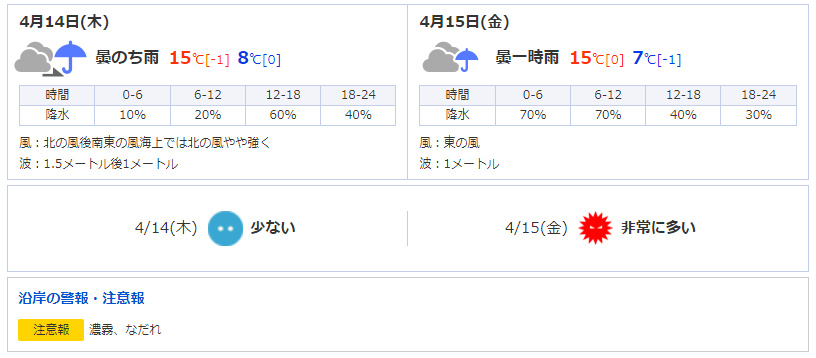

# 4K_Info
 Let's digital signage get started

### usage
```shell
git clone https://github.com/Fukuda-B/4K_Info
cd 4K_Info/py
python disp.py
```

### memo
|  |  |
| --- | --- |
| [./py/](./py/) | yahoo weather scraping |
| [./node/](./node/) | nothing |

### example



GetYahooInfo.Weather
```js
{
    0: {
        'date': '4月14日(木)',
        'weather': '曇のち雨',
        'temp_high': '15℃[-1]',
        'temp_low': '8℃[0]',
        'fall': {
            '0-6': '10％',
            '6-12': '20％',
            '12-18': '60％',
            '18-24': '40％'
        },
        'wind': '北の風後南東の風海上では北の風やや強く',
        'wave': '1.5メートル後1メートル'
    },
    1: {
        'date': '4月15日(金)',
        'weather': '曇一時雨',
        'temp_high': '15℃[0]',
        'temp_low': '7℃[-1]',
        'fall': {
            '0-6': '70％',
            '6-12': '70％',
            '12-18': '40％',
            '18-24': '30％'
        },
        'wind': '東の風',
        'wave': '1メートル'
    }
}
```

GetYahooInfo.Warn
```js
{
    0: {
        '注意報': '濃霧、なだれ'
    }
}
```

GetYahooInfo.Kafun
```js
{
    0: {
        'date': '4/14(木)',
        'info': '少ない'
    },
    1: {
        'date': '4/15(金)',
        'info': '非常に多い'
    }
}
```
